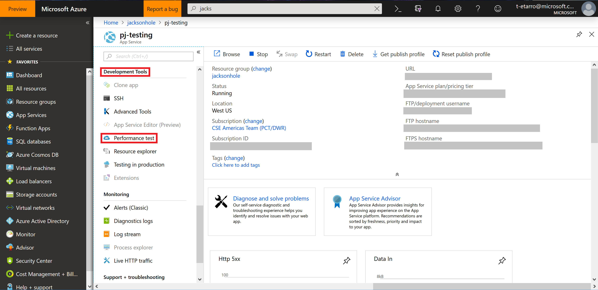
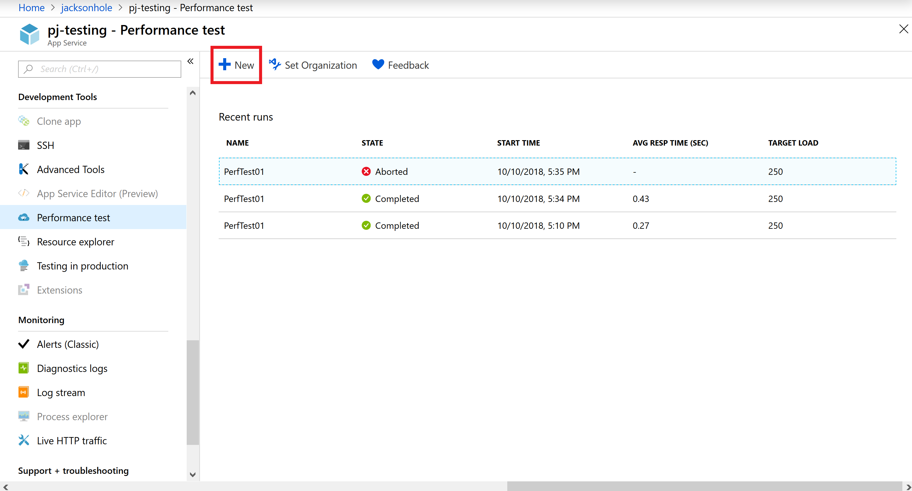
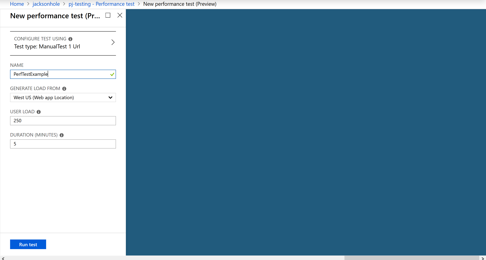

# Project Jackson Infrastructure

This repository includes the ARM templates for Project Jackson.

## Global ARM Template

__Regional resources depend on Global ARM resources. Complete this deployment first, so those variables can be used below.__

To deploy all the global resources, see the [Global Readme](./global-resources/README.md) which includes details on populating a [CosmosDB](https://azure.microsoft.com/en-us/services/cosmos-db/) instance with test data. 

## Regional ARM Template

To deploy all the resources, the script deploy.sh can be used.
The below values are required as input to the script:

1. Azure Subscription ID
2. Azure Resource Group (Add existing if one exists; else create a new one)
3. Azure Deployment Location (i.e., EastUS, WestUS)
4. App-name: Application Name

Another way to deploy is to run one-click deploy for all resources using Deploy to Azure:

Once the ACR is deployed, follow these manual steps to set up CD pipeline:

1. Create a new variable group in Azure Pipeline Library
2. Create variable ACR_SERVER and set value to the server name, which will be the output of your deployment (<application name>container.azurecr.io)
3. Get values of username and password from container using Azure Portal
4. Create variables ACR_USERNAME and ACR_PASSWORD and set them to the values you got from the Azure Portal.

Your deployment resources can now be used as part of your CD pipeline.

## Environments

- Different environments like Dev, QA, Staging and Production environments are created under the resource group for all the resources to be deployed using ARM Template.
- Policies can be created between each of the environments to promote builds from one environment to another based on the requirements of the customer.
- These policies can differ for each customer and product.
- Once the tests under Dev environment passes, they can be approved to run on the QA environment based on policies set for approvals on each. These policies can be set under Azure DevOps Release Pipeline.

## Redis Cache

- A Redis cache is used to enhance query performance.
- The capacity of the Redis cache can be set to a value 1-6 in the ARM template.
- You and enable or disable non-SSL port in the ARM template.
- Azure allows 3 different values for the sku viz. Basic, Standard and Premium having different costs for each.

## Auto Scaling

- The app service uses auto scaling.  
- When the CPU usage for an instance exceeds 70%, the app will automatically be scaled to add another compute instance, up to up to 5 instances.  This limit can be changed based on requirements.
- When memory usage for an instance exceeds 70%, the app will automatically be scaled to add another compute instance, up to 5 instances. This limit can be changed based on requirements.
- The minimum number of instances is set to 1.  This means that if the memory used on an instance is less, the instances will be scaled down automatically.

## Performance Testing

To test the performance of an App Service:

1. Navigate to the Azure Portal for your App Service
2. Under `Developer Tools` select `Performance Testing`

3. Select `New`

4. Name the new performance test and configure the settings appropriately

5. Submit the test.  After resources are automatically allocated, the test will run.
6. After the test completes, Azure will automatically generate graphs and charts for analysis.
