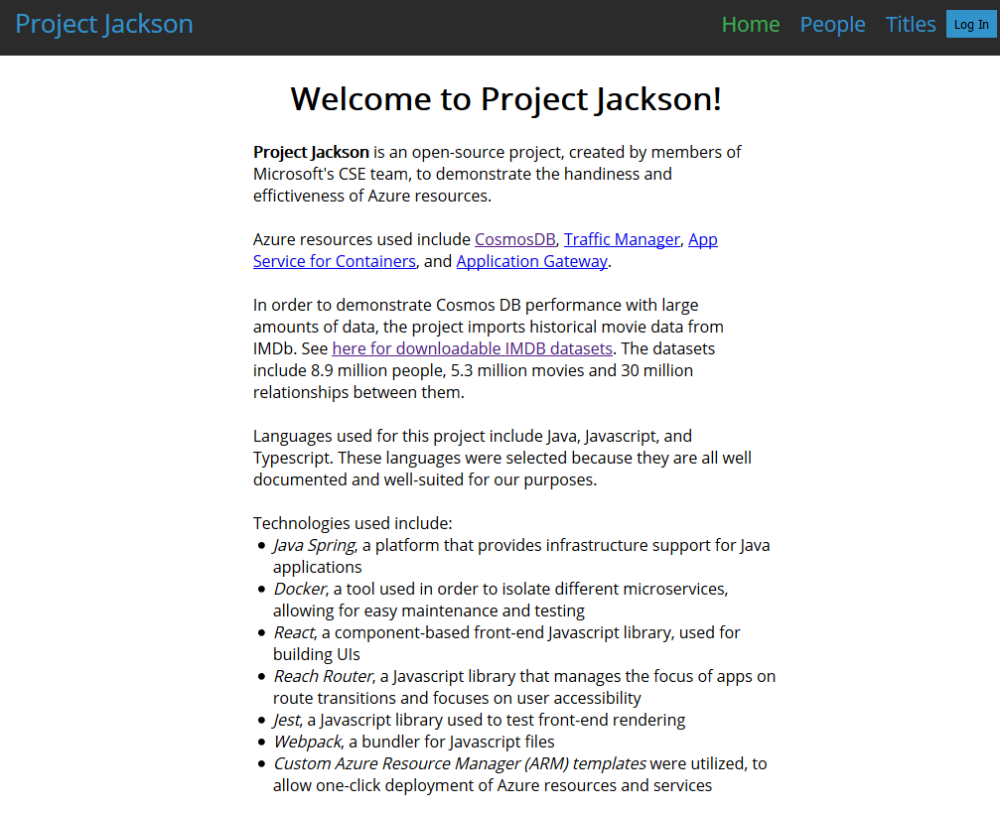

# Project Jackson Client

## Quickstart

This UI is written entirely in [TypeScript](https://www.typescriptlang.org/) and [JavaScript](https://en.wikipedia.org/wiki/JavaScript). It uses [Node.js](https://nodejs.org/en/) , [React.js](https://reactjs.org), and [webpack](https://webpack.js.org/) as well as various dependencies from [NPM](https://www.npmjs.com/). To get started:
- Install (or update) latest version of `Node.js`
  This includes the latest version of `NPM` as well.
- Run `cd ui` from the root of this project to navigate into the client directory
- Run `npm install` to install necessary dependencies
- Start the dev server using `npm run dev` 
  If you'd like to learn about configuring Authentication with AAD and an API URL read the [Environment Variables](#environment-variables) section
- Access your local dev instance at http://localhost:3000. `webpack-dev-server` should open this automatically in your default browser. If everything was setup correctly you should see a landing page like this:

- When you are ready to ship to production, you can run `npm run build` for an optimized production build. It will be output to the `dist/` directory. Refer to our [infrastructure](../infrastructure/readme.md) documentation for more information on deploying this application to a production environment.

## Environment Variables

The application is built to support authentication with Azure Active Directory and interact with the API defined in [`containers-rest-cosmos-appservice-java/api`](../api). To obtain your AAD keys follow [this](docs.microsoft.com/en-us/azure/active-directory/develop/howto-create-service-principal-portal) tutorial from the Microsoft Doc website. For more information on setting up AAD read our [AAD setup guide](../docs/azureActiveDirectory.md). You must specify the following environment variables in order to connect the UI to these aspects of your project:
  - `WEBPACK_PROP_AAD_CLIENT_ID` - OAuth provider application ID from Azure Active Directory portal
  - `WEBPACK_PROP_API_BASE_URL` - API Base url such as `http://localhost:8080` or `https://example.com/api`
  - `WEBPACK_PROP_UI_BASEPATH` - basepath string for which the UI will be served from. This is used for client side routing. **The basepath is defaulted to `ui`**.
    - Valid entries for this variable include the following literals: `\abc`, `abc`. 
    - Invalid entries include: `/abc` or `\/abc`. The system file path will be prepended to your route and break the client side router. 
    - `webpack-dev-server` is configured to automatically start the UI app from the basepath environment variable
  - *Note* both environment variables are optional and the app will build without them.
  ```bash
  # On Windows we can use:
  set WEBPACK_PROP_AAD_CLIENT_ID=abc123
  # On Linux we can use:
  export WEBPACK_PROP_AAD_CLIENT_ID=abc123
  ```
- Alternatively, you can prepend these environment variables to the `npm run dev` command such as:
  ```bash
  WEBPACK_PROP_AAD_CLIENT_ID=abc123 WEBPACK_PROP_API_BASE_URL=http://localhost:8080 WEBPACK_PROP_UI_BASEPATH=ui npm run dev
  ```
- Remember to set up these environment variables with your deployment pipeline as shipping a production build without these values will result in a poor user experience.

## Dependency Walkthrough

This project is written in a typed version of `JavaScript` called [`TypeScript`](https://www.typescriptlang.org/). It requires a `build` step that is handled by [`webpack`](https://webpack.js.org/). There is one main `webpack` config filed called [`webpack.common.js`](./webpack.common.js) and two aditional configs for [`development`](./webpack.dev.js) and [`production`](./webpack.prod.js). Using the `npm run dev` command will merge and use the `common` and `dev` configs, and `npm run build` will merge and use the `common` and `prod` configs. 

`webpack` compiles the `TypeScript` source code into `JavaScript`, then it bundles all of that code into a single `bundle.js` file that is loaded into a basic `index.html` file. Running `npm run build` will generate these files in a `dist/` director. `webpack` is also responsible for loading in the Azure Active Directory Client ID and API Base URL through process environment variables. We have included `webpack-dev-server` in the `development` config to enable developers a better developer experience. It hot-reloads UI changes in browser as you make changes to files in your editor. Be sure to use the output from `npm run build` when shipping to production as the build output from this command is compressed and optimized for production.

The UI itself is built using [`React.js`](https://reactjs.org/). The `package.json` should enforce the correct `React.js` version; however, if for whatever reason you need to make changes, you must use `React.js` version `16.6.x` or greater. The application makes use of the new `Context` api for managing state accross DOM Nodes. It uses a great module called [`Reach Router`](https://reach.tech/router) which is an accessibility-first client-side routing library. Microsoft's own authentication library [`MSAL`](https://github.com/AzureAD/microsoft-authentication-library-for-js) is used for the client side authentication. It is essential if your API is configured with OAuth tokens (as such in the case of the code in `./../api`). 

## Testing & Linting

> *tldr:* Run test suite using: `npm run test`. Run linter using: `npm run lint`

The UI is tested using `Jest` and `Enzyme`. All tests are written in `TypeScript` and are compiled/run in a similar way to how the `webpack` configs are set up. You can run the test suite using `npm run test`. A majority of the testing utilizies snapshots; if you are making a user interface change you will need to update the snapshots using: `npm run test -- --updateSnapshot`. 

In conjunction with `TypeScript` typings, developers can utilize our `tslint` configuration to lint their projects. If you are using VS Code, the editor will lint for you as you develop; otherwise, run `npm run lint` to verify the code fits our formatting standards.